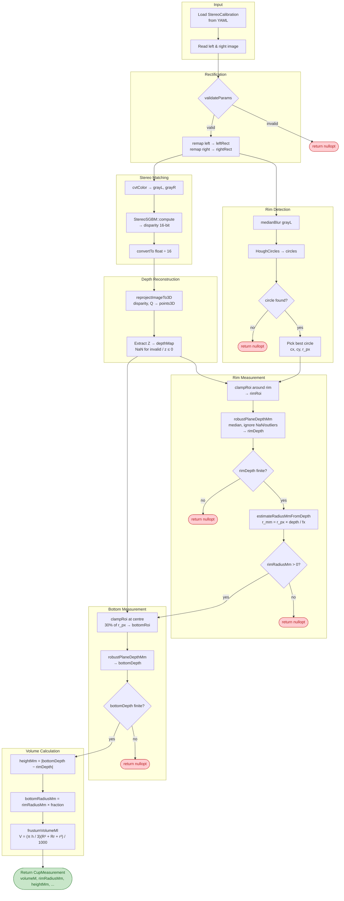

# Stereo Cup Volume Estimation

A C++20 / OpenCV demo that estimates the volume of a cup from a calibrated stereo camera pair.

The project is structured as a **testable library** (`cup_lib`) with a thin CLI wrapper, demonstrating engineering practices suitable for production-grade computer-vision code.

## Project structure

```
├── CMakeLists.txt              # Build system (library + demo + tests)
├── stereo_cup_volume.hpp       # Public API (pure functions, no global state)
├── stereo_cup_volume.cpp       # Implementation
├── main.cpp                    # CLI entry point
├── .github/workflows/ci.yml   # GitHub Actions CI
├── .devcontainer/              # GitHub Codespaces config
└── tests/
    ├── test_volume.cpp         # Frustum volume formula
    ├── test_depth_stats.cpp    # Robust median depth with NaN / outlier handling
    ├── test_geometry.cpp       # Pixel→mm radius conversion
    ├── test_params.cpp         # Parameter validation
    ├── test_roi.cpp            # ROI clamping & shrinking
    └── test_integration.cpp    # End-to-end pipeline (needs test data)
```

## Prerequisites

| Dependency | Version  |
|------------|----------|
| CMake      | ≥ 3.20   |
| C++ compiler | C++20  |
| OpenCV     | ≥ 4.x    |

GoogleTest is fetched automatically via `FetchContent` (v1.14.0).

## Build

```bash
cmake -B build -DCMAKE_BUILD_TYPE=Release
cmake --build build --config Release
```

To skip tests:

```bash
cmake -B build -DBUILD_TESTS=OFF
```

## Run the demo

```bash
./build/demo <calib.yml> <left.png> <right.png>
```

## Run tests

```bash
cd build
ctest --output-on-failure
```

Or run directly:

```bash
./build/unit_tests          # fast, deterministic, no test data required
./build/integration_tests   # needs tests/data/{calib.yml, left_01.png, right_01.png}
```

### Test data for integration tests

Place your own stereo pair and calibration file in `tests/data/`:

```
tests/data/
  ├── calib.yml
  ├── left_01.png
  └── right_01.png
```

If no test data is present the integration tests are automatically **skipped** (not failed).

## Test philosophy

| Category | What is tested | Properties |
|----------|---------------|------------|
| **Unit tests** | Volume formula, depth statistics, pixel→mm conversion, parameter validation, ROI clamping | Fast, deterministic, CI-ready, no images needed |
| **Integration tests** | Full pipeline (rectify → disparity → detect → measure) | Threshold-based assertions, graceful skip without data |

The unit tests are designed to demonstrate **engineering maturity**: edge-case handling, NaN robustness, and clear separation of testable logic from the OpenCV pipeline.

## Algorithm overview



> The full PlantUML source is in [`docs/algorithm_activity.puml`](docs/algorithm_activity.puml).

## CI & Codespaces

**GitHub Actions** runs all unit tests on every push/PR — see the badge after first push:

```markdown

```

**GitHub Codespaces** — click "Code → Codespaces → New" on the repo page to get a full dev environment in the browser with OpenCV pre-installed. Then:

```bash
cmake -B build -DCMAKE_BUILD_TYPE=Release
cmake --build build -j$(nproc)
ctest --test-dir build --output-on-failure
```

## License

MIT
